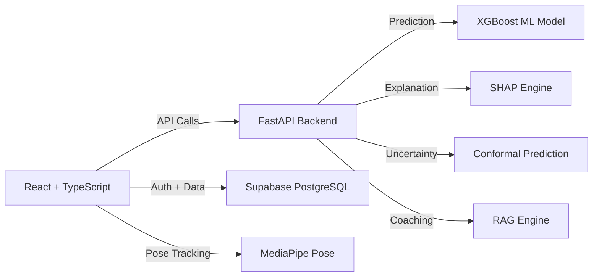
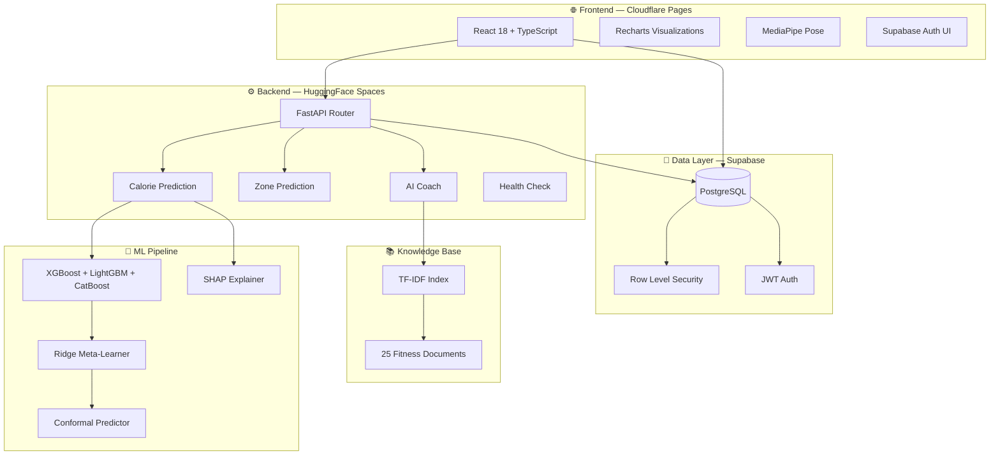
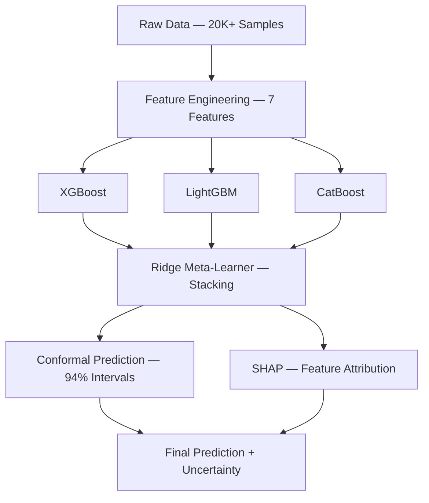

<div align="center">

# ⚡ NEXUS FIT

### AI Fitness Intelligence Platform

**Production-grade ML-powered fitness analytics with uncertainty quantification,  
RAG-based AI coaching, heart rate zone prediction, and real-time pose estimation.**

<br>

[](https://react.dev)
[](https://fastapi.tiangolo.com)
[](https://xgboost.ai)
[]()
[]()
[](https://supabase.com)
[](./LICENSE)

<br>

[🌐 **Live Demo**](https://nexus-fit.pages.dev) · [📖 **API Docs**](https://himanshuml24-nexus-fit-api.hf.space/docs) · [🧪 **Test Results**](./api/test_main.py)

<br>

</div>

---

## 🎯 What It Does

| Feature | Technology | Result |
|:--------|:-----------|:-------|
| **Calorie Prediction** | XGBoost + Conformal Prediction | R² = 0.9997 · MAE = 1.2 kcal · 94% coverage |
| **Heart Rate Zones** | Karvonen + Tanaka (ACSM Standards) | Zone 1–5 classification · Fat/Carb split |
| **AI Coach** | TF-IDF RAG · 25 Knowledge Documents | Evidence-based fitness advice with sources |
| **Explainability** | SHAP Feature Attribution | Per-prediction contribution breakdown |
| **Pose Estimation** | MediaPipe Pose · Real-time | Body tracking + joint angle analysis |
| **Auth & Security** | Supabase JWT + Row Level Security | Per-user data isolation |

---

## 🏗️ Architecture



<details>
<summary><b>🔧 Detailed Architecture</b></summary>



</details>

---

## 📸 Screenshots

<details>
<summary><b>🖥️ View Screenshots</b></summary>

| Dashboard | Workout Prediction | AI Coach |
|:---------:|:-----------------:|:--------:|
|  |  |  |

| Heart Rate Zones | Body Scan | Settings |
|:----------------:|:---------:|:--------:|
|  |  |  |

</details>

---

## 📊 ML Pipeline

<details>
<summary><b>🔬 View Full Pipeline Details</b></summary>



| Stage | Tool | Purpose |
|:------|:-----|:--------|
| Data | 20K+ exercise records | Calorie burn ground truth |
| Features | 7 engineered features | Age, Height, Weight, Duration, HR, Body Temp, Gender |
| Ensemble | XGBoost + LightGBM + CatBoost | Diverse model opinions |
| Stacking | Ridge Meta-Learner | Optimal combination of base models |
| Uncertainty | Conformal Prediction | Distribution-free confidence intervals |
| Explainability | SHAP | Per-prediction feature contributions |
| Optimization | Optuna | Bayesian hyperparameter search |
| Tracking | MLflow | Experiment versioning |

**Final Metrics:**
| Metric | Value |
|:-------|:------|
| R² | 0.9997 |
| MAE | 1.2 kcal |
| Coverage | 94% |
| Models Compared | 10+ |

</details>

---

## 🚀 Live Demo

| Service | URL | Status |
|:--------|:----|:-------|
| **Frontend** | [nexus-fit.pages.dev](https://nexus-fit.pages.dev) |  |
| **API** | [himanshuml24-nexus-fit-api.hf.space](https://himanshuml24-nexus-fit-api.hf.space) |  |
| **CI/CD** | [GitHub Actions](https://github.com/Himanshu431-coder/Nexus_Fit/actions) |  |

---

## 📡 API Endpoints

| Method | Endpoint | Description |
|:-------|:---------|:------------|
| `POST` | `/api/v1/predict` | ML calorie prediction + SHAP + confidence intervals |
| `POST` | `/api/v1/predict-zone` | Heart rate zone classification (Karvonen) |
| `POST` | `/api/v1/coach/chat` | RAG-powered AI fitness coach |
| `GET` | `/api/v1/health` | API health status |
| `GET` | `/api/v1/metadata` | Model metadata |
| `GET` | `/api/v1/drift-report` | Data drift analysis |
| `GET` | `/api/v1/model-comparison` | Model comparison metrics |

---

## 📁 Project Structure

<details>
<summary><b>📂 View Full Structure</b></summary>

```
Nexus_Fit/
├── .github/
│   └── workflows/
│       └── ci.yml                    # GitHub Actions CI/CD
│
├── api/                              # 🔧 FastAPI Backend
│   ├── main.py                       # App entry + CORS + routes
│   ├── requirements.txt              # Python dependencies
│   ├── Dockerfile                    # Container config
│   ├── test_main.py                  # 20 pytest tests
│   ├── v1/                           # API route handlers
│   │   ├── calories.py               # Calorie prediction
│   │   ├── zone.py                   # HR zone prediction
│   │   ├── coach.py                  # RAG AI coach
│   │   ├── health.py                 # Health check
│   │   └── insights.py               # Model insights
│   └── services/                     # Business logic
│       ├── prediction_engine.py      # XGBoost + SHAP + CP
│       ├── zone_engine.py            # Karvonen zone predictor
│       └── rag_engine.py             # TF-IDF RAG engine
│
├── ml/                               # 🧠 ML Pipeline
│   ├── models/                       # Trained models + artifacts
│   └── notebooks/                    # Training notebooks
│
├── src/                              # 🌐 React Frontend
│   ├── pages/                        # App pages
│   │   ├── Dashboard.tsx             # Real-time analytics
│   │   ├── Workouts.tsx              # ML prediction UI
│   │   ├── Coach.tsx                 # AI chat interface
│   │   ├── BodyScan.tsx              # Pose estimation
│   │   ├── Settings.tsx              # User settings
│   │   └── Auth.tsx                  # Login / Signup
│   ├── components/                   # Reusable UI components
│   ├── lib/                          # Supabase + utilities
│   └── index.css                     # TailwindCSS + theme
│
├── .gitignore
├── LICENSE                           # MIT License
├── package.json
├── tsconfig.json
├── tsconfig.app.json
├── tsconfig.node.json
├── vite.config.ts
└── README.md                         # This file
```

</details>

---

## 💻 Tech Stack

<details>
<summary><b>🛠️ View Full Tech Stack</b></summary>

| Category | Technologies |
|:---------|:-------------|
| **Frontend** | React 18 · TypeScript · Vite · TailwindCSS · Recharts · Framer Motion · MediaPipe |
| **Backend** | FastAPI · Python 3.11 · Uvicorn · Pydantic |
| **ML** | XGBoost · LightGBM · CatBoost · Ridge · SHAP · Conformal Prediction · Optuna · MLflow |
| **RAG** | TF-IDF · Cosine Similarity · 25 Fitness Knowledge Documents |
| **Database** | PostgreSQL (Supabase) · Row Level Security |
| **Auth** | JWT · Supabase Auth |
| **Testing** | pytest · httpx · 20/20 tests |
| **CI/CD** | GitHub Actions · Cloudflare Pages · HuggingFace Spaces |
| **Monitoring** | Data Drift Detection · Model Comparison · EDA Reports |

</details>

---

## 🧪 Testing

```bash
cd api
pip install -r requirements.txt pytest httpx
python -m pytest test_main.py -v
```

**Result: 20/20 tests passing ✅**

<details>
<summary><b>📋 View Test Results</b></summary>

```
test_health_returns_200              PASSED ✅
test_health_returns_status_healthy   PASSED ✅
test_health_has_version              PASSED ✅
test_predict_returns_200             PASSED ✅
test_predict_has_calories_burned     PASSED ✅
test_predict_has_confidence_interval PASSED ✅
test_predict_has_shap_features       PASSED ✅
test_predict_has_insight             PASSED ✅
test_predict_rejects_invalid_age     PASSED ✅
test_zone_returns_200                PASSED ✅
test_zone_has_valid_zone_number      PASSED ✅
test_zone_has_zone_name              PASSED ✅
test_zone_has_fat_carb_split         PASSED ✅
test_zone_rejects_invalid_heart_rate PASSED ✅
test_coach_returns_200               PASSED ✅
test_coach_returns_response          PASSED ✅
test_coach_returns_sources           PASSED ✅
test_coach_handles_empty_message     PASSED ✅
test_insights_model_info_returns_200 PASSED ✅
test_insights_drift_returns_200      PASSED ✅

20 passed in 3.54s
```

</details>

---

## 🏃 Run Locally

<details>
<summary><b>⚙️ Setup Instructions</b></summary>

### Prerequisites
- Python 3.11+
- Node.js 18+

### 1. Clone
```bash
git clone https://github.com/Himanshu431-coder/Nexus_Fit.git
cd Nexus_Fit
```

### 2. Backend
```bash
cd api
python -m venv venv
venv\Scripts\activate          # Windows
source venv/bin/activate       # macOS/Linux
pip install -r requirements.txt
uvicorn main:app --reload --port 8000
```

### 3. Frontend
```bash
npm install
npm run dev
```

### 4. Open
```
Frontend: http://localhost:8080
API Docs: http://localhost:8000/docs
```

</details>

---

## 👤 Author

<div align="left">

**Himanshu** — AI/ML & Data Engineering

[](https://github.com/Himanshu431-coder)
[](https://huggingface.co/HimanshuML24)

</div>

---

<div align="center">

**Built with ❤️ and ML**

[⬆ Back to Top](#-nexus-fit)

</div>